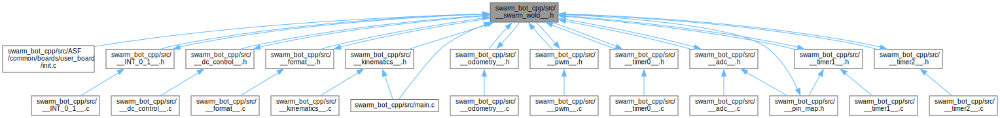

# SWARM-Bot fimrware

## Introduction

A robot operating system for a swarm-bot. Embedded C firmware for a mobile robot. 8-bit AVR microcontroller. Part of a graduation project.

Build using atmel studio but can be moved to makefile at will.

**Documentation**
Please follow this url for a gh-pages with full documentation of the sources. You can find file maps and dependency graphs in each class description. [Documentation Site](https://adnan-saood.github.io/swarm-robot-firmware/)

    

## File Structure

